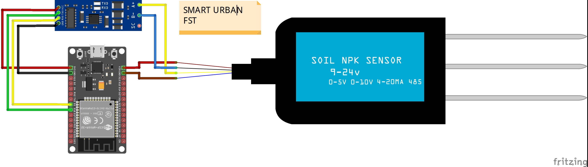

# esp32_rs485_npk-sensor

https://embeddedthere.com/how-to-interface-esp32-with-rs485-modbus-sensors-with-example-code/ #referensi code

https://forum.arduino.cc/uploads/short-url/cpsquBZYLs0EudM3EW2uAU3ChlJ.pdf #datasheet sensor

| NPK SENSOR | MODULE RS485 | ESP32    |
| ---------- | ------------ | -------- |
| RS485A     | A+           | -        |
| RS485B     | B-           | -        |
| VCC        | VCC          | Vin (5V) |
| GND        | GND          | GND      |
| -          | RX           | GPIO05   |
| -          | TX           | GPIO18   |

